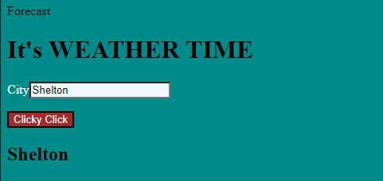
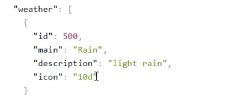
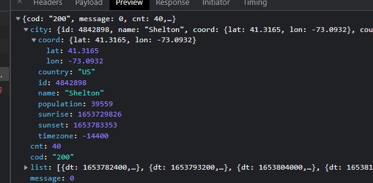
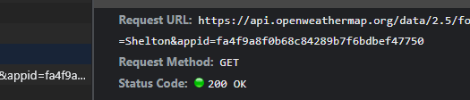
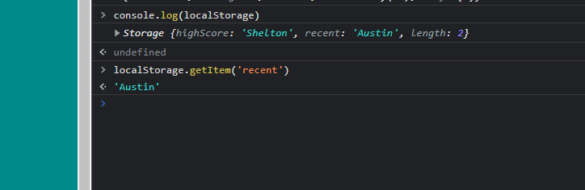
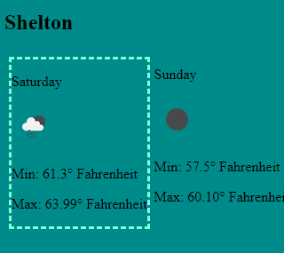

# weathertime

## Description 
 

 
The script.js has information on why/how this is important for getting the right icon to display and an example of how to do it. 

 
First thing I did when setting this up was making sure I could make a good API call with my API key. .

 

 
Saving searched city into local storage.

 

Example of dashed border to pin out the current days weather. 

 

## Table of Contents 

- [Description](#Description)
- [Installation](#installation)
- [Usage](#usage)
- [License](#license)
- [Instructions](#Instructions)
## Installation

Just open the index.html

## Usage

You could use this to get the weather for the next 5 days.

## License

 

## Instructions

Double click, index.html input whatever city you would like, just the city not the state. Like Shelton, Seattle or Dallas. 

## GitHub

recommend following https://www.youtube.com/c/BeginnersGuideprogramming as he has a great walkthrough 

https://home.openweathermap.org/ 
 
This website has easy to follow API usage for most use cases. This is the free API access that I utilized. 

recommend w3schools for easy quick local storage https://www.w3schools.com/jsref/met_storage_setitem.asp

If you would like to vist my profile please feel free! 
[GitHub Profile](https://github.com/savagescoles) 

